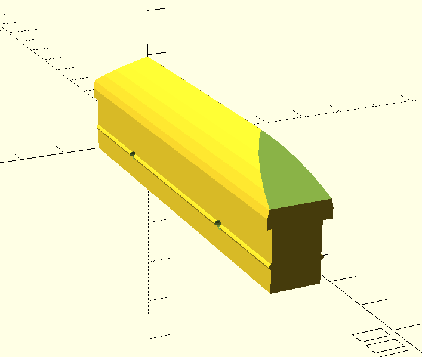

# Screen door rail guide

Problem was that my screen door is misaligned with the rail.  This caused it to jam when closing.  This piece slides in the door and is "Tall" enough to keep the door
in the rail.

